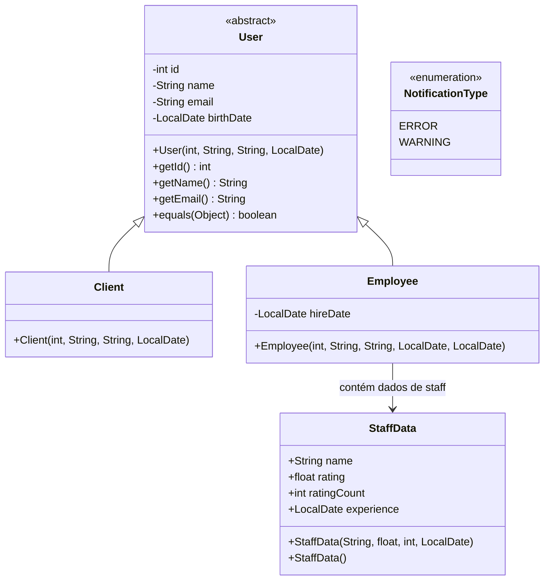
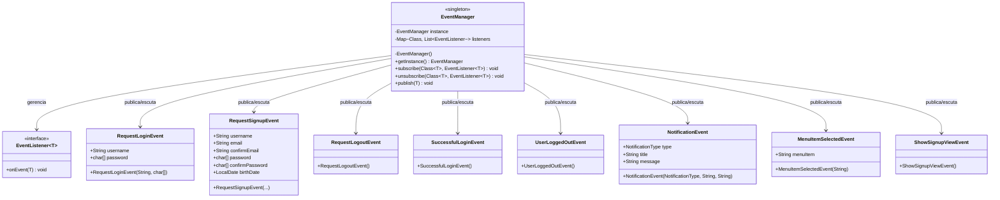
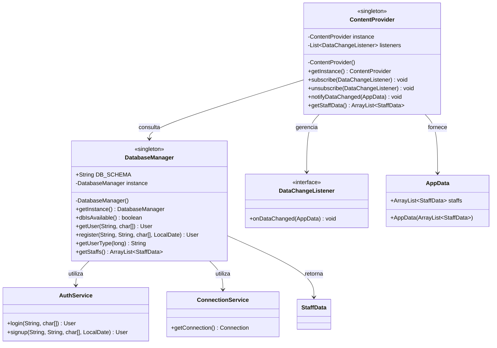
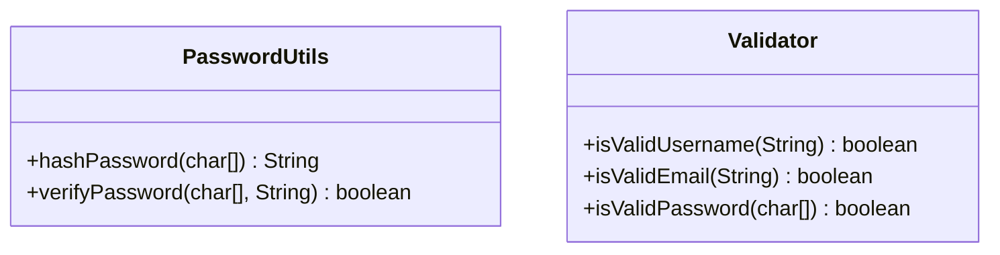
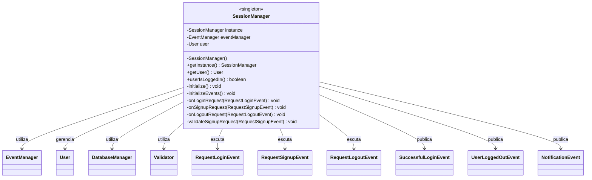
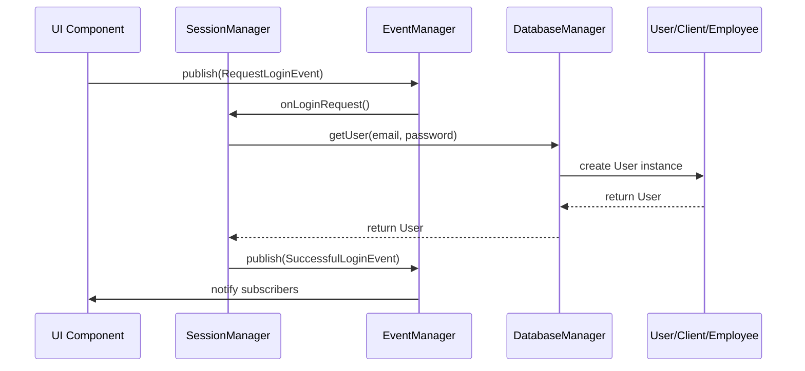

# Diagrama de Classes - Beauty Maker

Este documento apresenta os diagramas de classes para os principais pacotes da aplicação Beauty Maker, organizados por responsabilidades e arquitetura.

## Pacote Model

### Hierarquia de Usuários



### Relacionamentos do Model

- **User**: Classe abstrata base para todos os tipos de usuário
- **Client**: Herda de User, representa clientes do sistema
- **Employee**: Herda de User, possui data de contratação adicional
- **StaffData**: DTO para dados de funcionário com avaliações
- **NotificationType**: Enum para tipos de notificação do sistema

## Pacote Service

### Gerenciamento de Eventos



### Gerenciamento de Dados



### Utilitários do Service



## Pacote Session

### Gerenciamento de Sessão



## Arquitetura Geral do Sistema

### Visão de Alto Nível

```mermaid
classDiagram
    class UIComponents {
        <<package>>
        Views, Panels, Forms
    }
    
    class SessionLayer {
        <<package>>
        SessionManager
    }
    
    class ServiceLayer {
        <<package>>
        EventManager
        DatabaseManager
        ContentProvider
    }
    
    class ModelLayer {
        <<package>>
        User, Client, Employee
        StaffData, NotificationType
    }
    
    UIComponents --> SessionLayer : interage via eventos
    SessionLayer --> ServiceLayer : utiliza serviços
    ServiceLayer --> ModelLayer : manipula dados
    ServiceLayer -.-> UIComponents : notifica via eventos
```

## Padrões de Design Implementados

### Singleton Pattern
- **EventManager**: Garante único ponto de comunicação entre componentes
- **SessionManager**: Controla estado único de autenticação
- **DatabaseManager**: Gerencia conexões e operações de banco
- **ContentProvider**: Fornece dados de forma centralizada

### Observer Pattern
- **EventManager**: Implementa publisher-subscriber para comunicação
- **ContentProvider**: Notifica mudanças de dados para observadores

### Strategy Pattern
- **EventListener**: Permite diferentes estratégias de tratamento de eventos

### DTO Pattern
- **StaffData**: Transfere dados de funcionário com campos públicos

## Fluxo de Comunicação



## Considerações de Arquitetura

### Separação de Responsabilidades
- **Model**: Entidades de domínio e dados
- **Service**: Lógica de negócio e infraestrutura
- **Session**: Gerenciamento de estado de usuário
- **UI**: Interface e interação (não incluída neste diagrama)

### Comunicação Desacoplada
- Eventos permitem comunicação assíncrona
- Componentes não dependem diretamente uns dos outros
- Facilita manutenção e extensibilidade

### Persistência e Dados
- DatabaseManager centraliza acesso ao banco
- ContentProvider oferece cache e notificações reativas
- StaffData serve como DTO para transferência eficiente